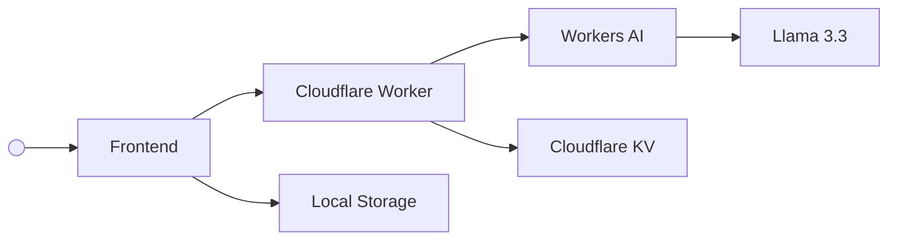

<div align="center">

# AI Code Reviewer

**Lightweight AI code review application powered by Cloudflare Workers AI**


[](LICENSE)

https://github.com/user-attachments/assets/e8d733ac-7d78-4a58-ac6c-d042df8c1aba

</div>

---

This project was implemented for the Software Engineering Internship assignment, built with Codex using GPT-5.5 (Medium).
The prompts used can be found in [`PROMPTS.md`](./PROMPTS.md).

## Features

- Structured AI code review with actionable feedback
- Covers multiple aspects of code quality (correctness, security, maintainability, performance, style, documentation, and other)
- Each issue is annotated with an explanation, suggestion, severity, confidence level, and source code position
- Overall rating and summary of the review
- Review persistence in a key-value storage
- Follow-up chat to ask for further explanations or provide additional context that may change the review

## Workflow

1. User pastes code into the editor and clicks the review button
2. The code is sent to the LLM with a system prompt that instructs how it should analyze the code and structure the response in JSON
3. The LLM returns structured review feedback
4. The review is stored and displayed to the user
6. The user can use the chat to ask follow-up questions or provide additional context

Example of the structured review feedback returned by the LLM:

```json
{
  "summary": "...",
  "rating": 7.5,
  "issues": [
    {
      "type": "correctness",
      "severity": "high",
      "message": "...",
      "suggestion": "...",
      "confidence": "high",
      "location": { "line": 12, "column": 5 }
    }
  ]
}
```

## Architecture

- **Frontend** (React, Vite, Worker Static Assets): user interface to paste code, view review results, manage sessions, and chat about a review
- **Backend** (Cloudflare Worker): handles API requests, validates payloads, calls the LLM, and stores/retrieves sessions
- **LLM** (Workers AI, Llama 3.3): performs code analysis and generates structured feedback
- **Data Storage** (Cloudflare KV): stores review sessions
- **Session Storage** (Local Storage): saves user preferences and the user session id



## Getting Started

### Deployed App

This app is deployed on Cloudflare Workers and can be accessed at:

https://ai-code-reviewer.r1c4rdco5t4-f9d.workers.dev

### Local Setup

Requirements:

- Node.js
- npm
- A Cloudflare account

Install dependencies:

```sh
cd app
npm install
```

You can set the `VITE_USE_MOCK_REVIEW` variable in `.env.development` to `true` to use a mock review response without calling Workers AI, which is useful for development without consuming AI credits.

Then, login to your Cloudflare account and create a new Cloudflare KV namespace:

```sh
npx wrangler login
npx wrangler kv namespace create SESSIONS_KV
```

Then, update `wrangler.jsonc` with the generated KV namespace id.

Finally, run the development server and open the app in your browser at `http://localhost:5173`:

```sh
npm run dev
```

To deploy the app to Cloudflare Workers, run:

```sh
npm run deploy
```

## References

- https://agents.cloudflare.com
- https://workers.cloudflare.com
- https://developers.cloudflare.com/workers-ai
- https://developers.cloudflare.com/kv
